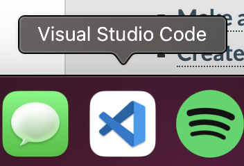
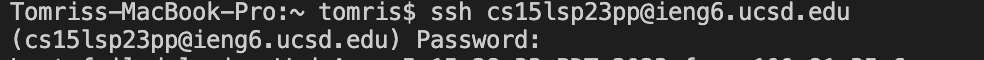
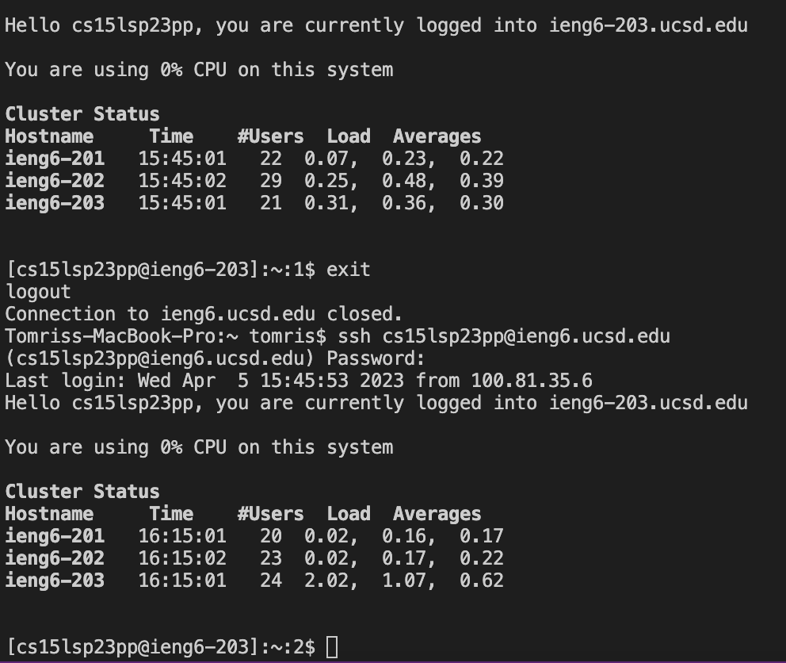
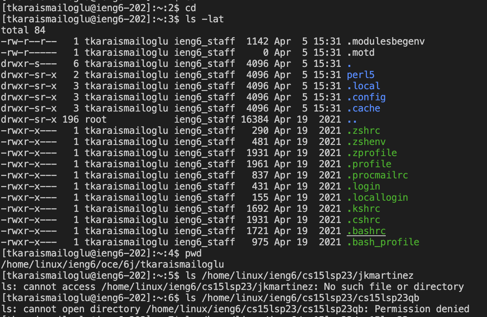

# **Logging into a Course Specific Account**
## 1. Make sure you have VSCode
Find it on your dock and click on it because it's installed from previous quarters!

## 2. Looking up your username
Go to the [account lookup website](https://sdacs.ucsd.edu/~icc/index.php). Log in and find your cse15l account name.

## 3.  Making sure you have git
In VSCode enter the command `git --version` to see if you have git installed.

## 4. Connecting to the remote server
Enter `ssh` + your the course specific username you found followed by `@ieng6.ucsd.edu`

## 5. Enter your password
Your password will not show up but you can still enter it. Hit the ENTER button when done.

## 6. Welcome Text
You should see the welcome message at if password was entered correctly. Now you can try some commands.
 

## 7. Run Commands
Try a few such as: 
* `cd ~`
* `cd`
* `ls -lat`
* `ls -a`

