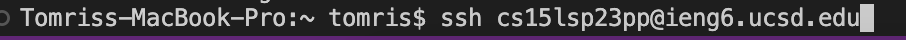

# **Logging into a Course Specific Account**
## 1. Make sure you have VSCode
Find it on your dock and click on it because it's installed from previous quarters! However, if you don't have it, you can go to [VSCode Download](https://code.visualstudio.com/download) and choose your operating system.

## 2. Looking up your username
Go to the [account lookup website](https://sdacs.ucsd.edu/~icc/index.php). Log in and find your cse15l account name.

## 3.  Making sure you have git
In VSCode enter the command `git --version` to see if you have git installed. 
If not, go to [Git Download](https://git-scm.com/downloads) and pick your operating system and download the appropriate version of Git.

## 4. Connecting to the remote server
Enter `ssh` + your the course specific username you found followed by `@ieng6.ucsd.edu`

## 5. Enter your password
Your password will not show up but you can still enter it. Hit the ENTER button when done.

## 6. Welcome Text
You should see the welcome message at if password was entered correctly. Now you can try some commands.
 

## 7. Run Commands
Try a few such as: 
* `cd` changes directory
* `cd ~` changes directory with an argument
* `ls` lists the files in a folder
* `ls -a` lists all files in a folder, even the hidden ones that begin with `.`

Above, I ran various commands. Such as `pwd` which prints the working directory. And `ls lat` which gives the full list of hidden files. I also attempted to print the file names in my lab partners' file. But I was denied permission to view them.
